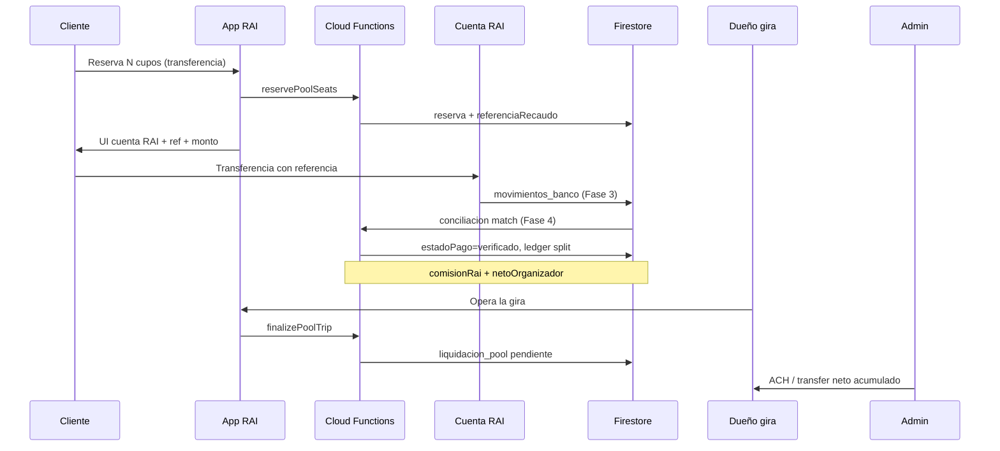

# Plan técnico — Giras por cupos con recaudo central RAI

**Estado:** Diseño para implementación — **sin código en prod hasta flags ON**  
**Prerequisito recomendado:** Fases 3–5 del plan financiero general (`movimientos_banco`, `conciliaciones`, `referenciaRecaudo` en cuenta RAI)  
**Principio:** Misma “caja recaudo digital” que taxi; prepago solo para cupos en **efectivo al abordar**.

---

## 1. Objetivo de negocio

| Hoy (Pool legacy) | Objetivo (Pool recaudo central) |
|-------------------|----------------------------------|
| Cliente transfiere depósito (~30%) a **cuenta del organizador** | Cliente transfiere a **cuenta corporativa RAI** |
| RAI cobra comisión al organizador vía **prepago apartado al publicar** | RAI retiene **% por reserva verificada** del dinero recaudado |
| Confirmación de pago manual (organizador/admin) sin conciliación bancaria | Verificación por **referencia única** + conciliación (o admin) |
| Neto implícito: organizador ya tiene el depósito en su banco | Neto **retenido en RAI** → **liquidación al dueño** al cerrar gira o batch semanal |

**Control estricto:** un ledger por reserva (`bruto`, `comisionRai`, `netoOrganizador`, `estadoPago`).

---

## 2. Modelo contable (dos cajas, extendido a Pool)

```
┌─────────────────────────────────────────────────────────────┐
│ CAJA RECAUDO DIGITAL (cuenta RAI)                           │
│  Entrada: transferencia/tarjeta cliente por reserva pool    │
│  Salida:  liquidación neto → dueño de gira (ACH/manual)      │
│  Retención: comisión RAI por tique (no por “gira entera”)   │
└─────────────────────────────────────────────────────────────┘

┌─────────────────────────────────────────────────────────────┐
│ CAJA PREPAGO (billeteras_taxista) — solo cupos EFECTIVO     │
│  Entrada: recargas organizador                              │
│  Salida:  comisión RAI al confirmar/abordar cupo efectivo   │
└─────────────────────────────────────────────────────────────┘
```

**Regla:** reservas `metodoPago=transferencia` **nunca** usan prepago gira (`saldoReservadoParaGiras`) en el modelo nuevo.

---

## 3. Feature flags (`config/finance`)

| Campo | Default | Efecto |
|-------|---------|--------|
| `poolRecaudoCentralHabilitado` | `false` | Master switch Pool recaudo RAI |
| `poolRecaudoSoloNuevasGiras` | `true` | Solo pools con `recaudoModelo: 'central'` |
| `poolLiquidacionAlFinalizar` | `true` | Neto se libera al `finalizePoolTrip` (vs semanal) |
| `poolDeprecarPrepagoAlPublicar` | `false` | Fase E: no apartar `comisionGiraEstimadaRd` si recaudo central |
| `transferenciaRecaudoEnCuentaRai` | (existente) | Debe estar ON para Pool transferencia |

Paridad cliente ↔ CF: `FinanceConfigService` + lectura en `pool_finance.ts` / triggers.

---

## 4. Referencia de recaudo por reserva

Reutilizar patrón `RAI-V-…` (`lib/utils/viaje_referencia_recaudo.dart`, `functions/src/viaje_referencia.ts`).

**Formato propuesto:** `RAI-P-{slugPool8}-{slugRes8}-{cs2}`

- Asignación **solo servidor** al crear reserva transferencia (`reservePoolSeats` o trigger `onPoolReservaCreated`).
- Registro en `referencias_recaudo/{ref}` con `{ tipo: 'pool', poolId, reservaId, uidCliente }` (extender `referencia_recaudo_registry.ts`).

**Decisión de negocio (jun 2026):** en modelo `central`, el cliente transfiere el **100% del total de la reserva** a cuenta RAI (`montoRecaudoPct: 1.0`). No depósito parcial.

**Monto esperado en banco:** `total` de la reserva (100% × asientos × precio).

---

## 5. Campos nuevos

### `viajes_pool/{poolId}`

| Campo | Tipo | Notas |
|-------|------|-------|
| `recaudoModelo` | string | `'legacy'` \| `'central'` — set al crear si flag ON |
| `cuentaRecaudoRai` | bool | snapshot config al publicar |
| `montoRecaudadoRaiRd` | number | suma verificada en cuenta RAI |
| `montoComisionRaiRd` | number | suma comisiones retenidas |
| `montoNetoOrganizadorRd` | number | suma neto pendiente / liquidado |
| `liquidacionOrganizadorEstado` | string | `pendiente` \| `parcial` \| `liquidado` |
| `liquidacionOrganizadorAt` | timestamp | |

Campos legacy (`comisionGiraEstimadaRd`, `prepagoComisionEtapa`, `bancoCuenta`, …) **se mantienen** para giras `recaudoModelo=legacy`.

### `viajes_pool/{poolId}/reservas/{reservaId}`

| Campo | Tipo | Notas |
|-------|------|-------|
| `referenciaRecaudo` | string | única |
| `estadoPago` | string | `pendiente` \| `verificado` \| `rechazado` |
| `montoEsperadoRecaudoRd` | number | deposit o total |
| `comisionRaiRd` | number | al verificar |
| `netoOrganizadorRd` | number | al verificar |
| `verificadoAt` | timestamp | |
| `movimientoBancoId` | string | link Fase 3 |
| `conciliacionId` | string | link Fase 4 |

### Colección `ledger_pool_reservas` (nueva)

Idempotente por `reservaId` + `tipo`:

```json
{
  "tipo": "recaudo_verificado",
  "poolId": "...",
  "reservaId": "...",
  "ownerTaxistaId": "...",
  "brutoRd": 1500,
  "comisionPct": 20,
  "comisionRaiRd": 300,
  "netoOrganizadorRd": 1200,
  "referenciaRecaudo": "RAI-P-...",
  "createdAt": "..."
}
```

### Colección `liquidaciones_pool` (nueva, Fase D)

Similar a `liquidaciones_semanales` pero agrupado por `ownerTaxistaId` + ventana o por `poolId`:

```json
{
  "ownerTaxistaId": "...",
  "poolId": "...",
  "reservaIds": ["..."],
  "netoTotalRd": 4800,
  "estado": "pendiente_pago",
  "metodoSalida": "manual_admin",
  "pagadoAt": null
}
```

---

## 6. Flujo por reserva (transferencia)



---

## 7. Fases de implementación

### Fase A — Fundamentos (sin cambio visible)

**Objetivo:** esquema + flags + referencias; pools siguen legacy.

| Área | Cambios |
|------|---------|
| `config/finance` | Nuevos flags (§3) |
| `finance_config_service.dart` | Leer flags pool |
| `functions/src/pool_referencia.ts` | `generarReferenciaRecaudoPool(poolId, reservaId)` |
| `referencia_recaudo_registry.ts` | Tipo `pool` |
| `ledger_pool_reservas` | Reglas Firestore admin-only write |
| Tests | Unitarios formato ref + idempotencia |

**CF:** ninguna obligatoria en prod con flags OFF.

**Riesgo:** bajo.

---

### Fase B — UI cliente: paga a RAI (flag ON, piloto)

**Objetivo:** reemplazar bloque “Cuenta para depósito (30%)” del organizador por panel recaudo RAI.

| Archivo | Cambio |
|---------|--------|
| `pools_cliente_detalle.dart` | Si `recaudoModelo==central`: `TransferenciaRecaudoUi` / cuenta RAI desde `config/recaudo` |
| `pool_repo.dart` / reserva | Mostrar `referenciaRecaudo` post-`reservePoolSeats` |
| `pools_taxista_crear.dart` | Al crear con flag ON: `recaudoModelo:'central'`, ocultar campos banco obligatorios (opcional guardar para liquidación saliente) |
| `pools_producto_copy.dart` | Copy: “Pagás a RAI; tu neto se transfiere al organizador tras la salida” |

**CF `reservePoolSeats`:** asignar `referenciaRecaudo`, `estadoPago:'pendiente'`, `montoEsperadoRecaudoRd`.

**Compatibilidad:** giras legacy siguen mostrando `bancoCuenta`.

**Riesgo:** medio (UX); probar en flavor cliente staging.

---

### Fase C — Verificación y split por tique

**Objetivo:** al verificar pago, calcular comisión y neto **por reserva**; no depender de prepago gira.

| Componente | Cambio |
|------------|--------|
| `conciliacion.ts` | Match `referenciaRecaudo` → subcolección `reservas` además de `viajes` |
| Nueva CF `verifyPoolReservaRecaudo` | Admin o post-conciliación: idempotente, escribe ledger + actualiza reserva/pool agregados |
| `confirmPoolReservationPayment` | **Legacy:** sin cambio. **Central:** solo si `estadoPago==verificado` (no “confirmar a ojo”) |
| `pool_finance.ts` `startPoolTrip` | Si `recaudoModelo==central`: **omitir** descuento prepago comisión (ya cobrada por tique) |

**Fórmula por reserva verificada:**

```
comisionRaiRd = round2(total * comisionPct / 100)
netoOrganizadorRd = round2(total - comisionRaiRd)
```

`comisionPct`: `pool.comisionGiraPctUsado` o remote (`getComisionViajePorcentajeCached`).

**Riesgo:** alto — dinero real; exigir idempotency + tests transaccionales.

---

### Fase D — Liquidación al dueño de la gira

**Objetivo:** RAI paga neto acumulado al organizador.

| Modo | Cuándo | Implementación |
|------|--------|----------------|
| **Al finalizar** (default flag) | `finalizePoolTrip` | Crear doc `liquidaciones_pool` con suma `netoOrganizadorRd` de reservas verificadas no liquidadas |
| **Semanal** | Job viernes | Reutilizar pipeline Fase 7 ACH con `tipoBeneficiario: pool_organizador` |

**Admin:**

| Pantalla | Acción |
|----------|--------|
| `admin_giras_tours_cupos.dart` | Ver recaudo RAI, neto pendiente, marcar “pagado organizador” |
| Nueva sección o extensión `verificar_pagos.dart` | Lista `liquidaciones_pool` |

**Requisito:** cuenta bancaria del organizador en perfil taxista (ya existe en registro) — validar completa antes de liquidar.

**Riesgo:** alto — salidas de dinero; empezar **manual admin** antes de ACH automático.

---

### Fase E — Deprecar prepago gira (solo recaudo central)

**Objetivo:** al publicar pool `central`, **no** mover `saldoPrepagoComisionRd` → `saldoReservadoParaGiras`.

| Archivo | Cambio |
|---------|--------|
| `pool_repo.dart` `crearPool` | Branch `recaudoModelo`; skip bloque prepago si central |
| `pool_finance.ts` | `startPoolTrip` / cancel / refund paths no-op prepago si central |
| `pools_taxista_crear.dart` | Quitar copy “apartamos comisión al publicar” para central |

**Migración:** no retroactiva; pools abiertos legacy terminan con prepago.

**Riesgo:** medio — bloqueos operativos si mezclar lógica; tests A/B legacy vs central.

---

### Fase F — Efectivo al abordar (opcional, posterior)

**Opciones (elegir una):**

1. **Mantener efectivo** in-app: al marcar “abordó / pagó efectivo”, CF descuenta comisión del **prepago** del organizador (por asiento) — sin recaudo RAI.
2. **Deshabilitar efectivo** en reservas central (solo transferencia/tarjeta) — máximo control, menos conversión.

Recomendación: **Fase F = opción 1** para no perder mercado; prepago mínimo operativo sigue aplicando.

---

## 8. Cloud Functions (resumen)

| Function | Fase | Descripción |
|----------|------|-------------|
| `reservePoolSeats` | B | Extender: ref + estadoPago |
| `verifyPoolReservaRecaudo` | C | Split comisión/neto idempotente |
| `onMovimientoBancoMatchPool` | C | Hook conciliación → verify |
| `finalizePoolTrip` | D | Crear liquidación organizador si central |
| `approveLiquidacionPool` | D | Admin marca pagado + auditoría |
| `startPoolTrip` | C/E | Bypass prepago si central |

**No tocar** salvo bugfix: `claimTripWithReason`, viajes normales en `finance.ts`.

---

## 9. Reglas de negocio fijas

1. **Comisión solo cupos vendidos en app** — sin cambio (`pools_producto_copy`).
2. **Ventas WhatsApp** — fuera de recaudo RAI; sin comisión.
3. **Cancelación reserva verificada** — política reembolso explícita (admin / partial keep comisión); registrar `ledger tipo=reembolso`.
4. **Cancelación gira** — devolver neto no liquidado al cliente vía proceso manual; comisión RAI según política (día de salida / no-show).
5. **No finalizar liquidación** si faltan reservas `pendiente` de conciliar (warning admin, no bloqueo duro opcional).

---

## 10. Convivencia legacy ↔ central

| `viajes_pool.recaudoModelo` | Cliente paga | Comisión RAI |
|----------------------------|--------------|--------------|
| `legacy` (default) | Cuenta organizador | Prepago inicio/cierre |
| `central` | Cuenta RAI + ref | Por reserva verificada |

**Detección app:** leer campo en detalle pool; no inferir solo por flag global.

**Admin:** filtro en listado giras por modelo.

---

## 11. Dependencias con plan financiero general

| Dependencia | Por qué |
|-------------|---------|
| Fase 3 `movimientos_banco` | Extracto Popular |
| Fase 4 `conciliaciones` | Match automático ref → reserva |
| Fase 5 cuenta RAI + QR | Misma UI/copy que taxi |
| Fase 2/7 liquidaciones | Patrón ACH saliente (opcional Fase D+) |

**Orden sugerido:** Finanzas 1→5 mínimo **en paralelo piloto** Pool B–C; D manual sin ACH.

---

## 12. Archivos clave (checklist)

### Cliente
- `lib/pantallas/servicios_extras/pools_cliente_detalle.dart`
- `lib/utils/transferencia_recaudo_ui.dart` (generalizar o wrapper pool)
- `lib/servicios/pool_repo.dart`

### Taxista
- `lib/pantallas/taxista/pools_taxista_crear.dart`
- `lib/pantallas/taxista/pools_taxista_detalle.dart` (ver neto pendiente)

### Admin
- `lib/pantallas/admin/admin_giras_tours_cupos.dart`
- Liquidaciones pool (nueva o extensión)

### Backend
- `functions/src/pool_finance.ts`
- `functions/src/conciliacion.ts`
- `functions/src/referencia_recaudo_registry.ts`
- `functions/src/finance.ts` (solo bloqueo operativo pool si aplica)

### Copy
- `lib/utils/pools_producto_copy.dart`

---

## 13. Plan de pruebas

| Caso | Esperado |
|------|----------|
| Reserva central + ref única | No colisión en `referencias_recaudo` |
| Conciliación monto exacto | `estadoPago=verificado`, ledger split correcto |
| Doble verify mismo ref | Idempotente, sin doble comisión |
| startPoolTrip central | No mueve `saldoReservadoParaGiras` |
| finalizePoolTrip central | `liquidaciones_pool` con neto correcto |
| Legacy gira abierta | Sin regresión prepago |
| Cancel reserva antes de pago | Libera cupo, sin ledger |
| Efectivo Fase F | Descuento prepago por asiento |

Script existente útil: `pre_flight_check.dart` (extender chequeo pools central).

---

## 14. Rollout recomendado

1. **Semana 1–2:** Fase A + tests; deploy CF sin flags.
2. **Semana 3:** Fase B piloto 1–2 organizadores (`recaudoModelo central` manual admin).
3. **Semana 4–5:** Fase C conciliación manual admin → automática.
4. **Semana 6:** Fase D liquidación manual; validar con banco neto saliente.
5. **Semana 7+:** Fase E default ON para nuevas giras; Fase F efectivo.
6. Comunicar taxistas: copy + soporte WhatsApp (guía aparte).

---

## 15. Qué NO romper

- Navegación shells, viajes activos taxi/turismo.
- `pool_finance` legacy paths con flag OFF.
- Anti-abuso giras (`PoolGiraAbusoBloqueo`).
- Reservas CF `reservePoolSeats` idempotency.
- Giras en curso al activar flags (solo `recaudoModelo` nuevo).

---

## 16. Validación banco / negocio (antes de Fase C prod)

- [ ] ¿Depósito 30% o pago 100% por reserva?
- [ ] ¿Liquidación organizador al finalizar gira o semanal global?
- [ ] ¿Reembolsos cancelación: quién absorbe comisión RAI?
- [ ] ¿Efectivo in-app se mantiene en modelo central?
- [ ] ¿Misma cuenta RAI y rail conciliación que taxi?

---

**Documento relacionado:** `docs/PLAN_ARQUITECTURA_FINANCIERA_RAI_FASES.md`, `docs/CURSOR_INSTRUCCIONES_FINANZAS_RAI.md`, `docs/REUNION_BANCO_POPULAR_AZUL_RAI.md`
